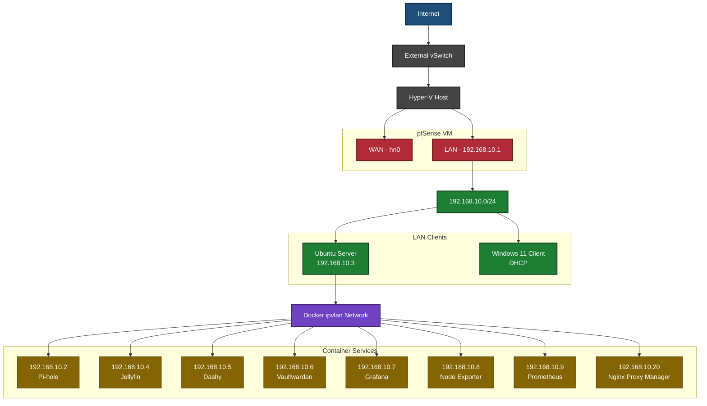
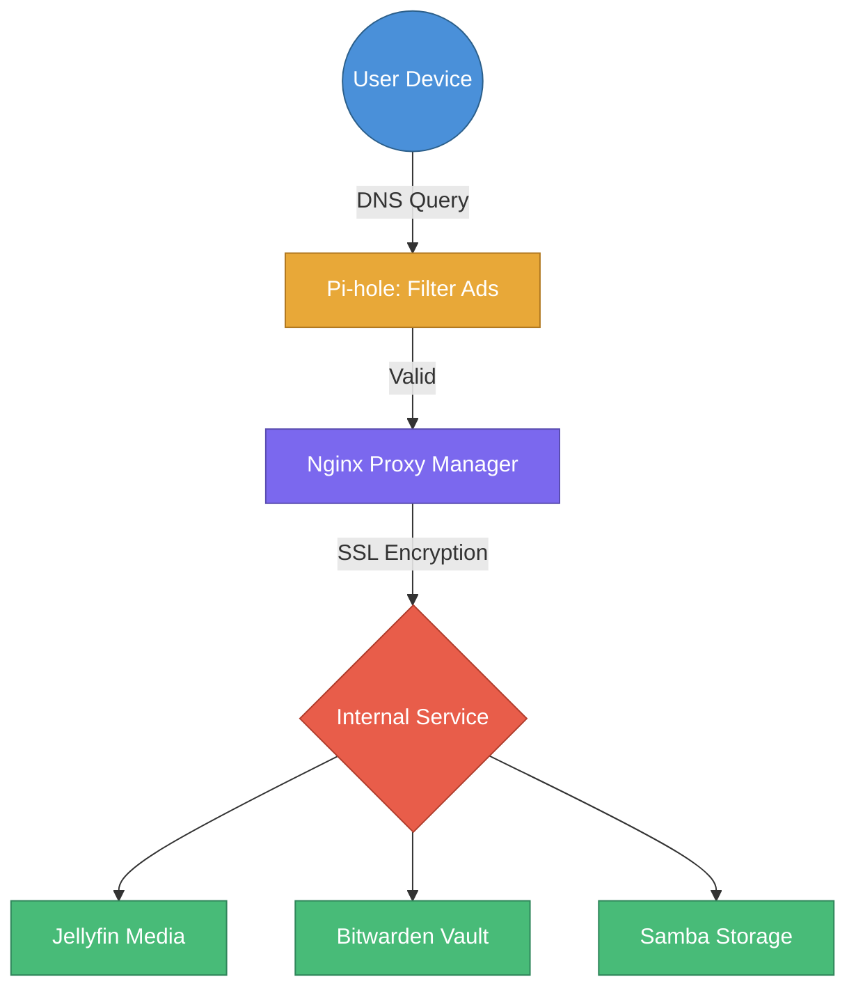

<div align="center">
  
</div>
<div align="center">
  <h1>Table of Contents</h1>
</div>


1. [**Summary**](#summary)
2. [**System Information**](#system-information)
   - [***Software Used***](software-used)
        - [***Operating Systems***](#operating-systems)
        - [***Hypervisors***](#hypervisors)
        - [***Tools***](#tools)
3. [**Network Design**](#network-design)
   - [***Logical Topology Diagram***](logical-topology-diagram)
   - [***Design Decisions***](design-decisions)
   - [***IP Addressing Scheme***](ip-adressing-scheme)
   - [***Routing***](#routing)
   - [***Firewall***](#firewall)
   - [***Security Design***](#security-design)
4. [**Implementation**](#implementation)
   - [***Hyper-V***](#hyper-v-setup)
     - [***Virtual Switches***](#virtual-switches)
   - [***pfSense***](#pfsense-setup)
       - [***Video Guide***](#pfsense-video-guide)
   - [***Ubuntu***](#ubuntu-server-setup)
       - [***NAS***](#nas-setup)
   - [***Docker / Portainer***](#docker-/-portainer-setup)
       - [***Pi-Hole***](#pihole-setup)
       - [***Jellyfin Setup***](#jellyfin-setup)
   - [***Containers***](#containers)
     - [***Reverse Proxy***](#reverse-proxy)
         - [***Creation of Certificate Authority***](#creation-of-certificate-authority)
         - [***Service Certificates and Keys***](#service-certificates-and-keys)
         - [***Nginx Proxy Manager Configuration***](#nginx-proxy-manager-configuration)
     - [***Ubuntu Server Security***](#ubuntu-server-security)
5. [**Testing & Validation**](#testing--validation)
   - [***Connectivity (Ping)***](#connectivity-(ping))
   - [***DHCP***](#dhcp)
6. [**Maintenance & Backup**](#maintenance--backup)
   - [***Create VM Snapshots and Checkpoints***](#create-vm-snapshots-and-checkpoints)
   - [***Updating Devices***](#updating-devices)
   - [***Network Backup and Recovery***](#network-backup-and-recovery)
7. [**Troubleshooting**](#troubleshooting)
   - [***Common Issues***](#common-issues)
8. [**Conclusion**](#conclusion)
   - [***Achievements***](#achievements)
   - [***Future Improvements***](#future-improvements)
9. [**Appendices**](#appendices)
    - [***Full Configurations***](#full-configurations)
    - [***References***](#references)

<hr/>

<div align="center" id="summary">
  <h1>Summary</h1>
</div>

Wojtek Network is a fully virtualized home network environment built using Microsoft Hyper-V.
The project aims to simulate a realistic, secure, and scalable home or small-office network by combining virtual machines, routing, containerised services, and centralised management tools.

The environment demonstrates real-world networking concepts including network segmentation, firewalling, DNS filtering, DHCP, container orchestration, and service hosting.

<hr/>

<div align="center" id="system-information">
  <h1>System Information</h1>
</div>

## Software Used (OS, Hypervisors, Containers, Tools)

#### Operating Systems
- [**Linux**](https://www.linux.org/)
    - [***pfSense***](https://www.pfsense.org/)
    - [***Ubuntu Server***](https://ubuntu.com/download/server)
- [**Windows**](https://www.microsoft.com/en-us/windows/?r=1)
    - [***Windows 11***](https://www.microsoft.com/en-us/software-download/windows11)
 
#### Hypervisors
- [**Hyper-V**](https://en.wikipedia.org/wiki/Hyper-V)

### Containers
- [**Portainer**](https://www.portainer.io/)
- [**Cockpit**](https://cockpit-project.org/)
- [**Pi-Hole**](https://pi-hole.net/)
- [**Jellyfin**](https://jellyfin.org/)
- [**Dashy**](https://dashy.to/)
- [**Bitwarden**](https://bitwarden.com/help/install-on-premise-linux/)
- [**Prometheus**](https://prometheus.io/download/)
- [**Node Exporter**](https://prometheus.io/docs/guides/node-exporter/)
- [**Grafana**](https://grafana.com/)

#### Tools
- [**GitHub**](https://github.com/)
- [**Discord**](https://discord.com/)
- [**Teams**](https://teams.live.com/free/)
- [**Docker**](https://www.docker.com/)

<div align="center" id="network-design">
  <h1>Network Design</h1>
</div>

## Logical Topology Diagram

<div align="center">
  <h3>Legend</h3>  
  🔵 Internet / Edge
  ⚫ Virtualisation Layer
  🔴 Firewall / Routing
  🟢 LAN Devices
  🟣 Container Network
  🟡 Application Services
</div>



## Design Decisions

The network was designed around security, managability, and isolation by implementing it in a fully virtualised environment within Hyper-V. A single dedicated virtual machine running pfSense acts as the central router and firewall, seperating the Wide Area Network from the internal Local Area Network and creating a default deny-all firewall policy. This ensures that all traffic is funneled through one point on the network allowing easier monitoring and management, along with the network segmentation being logically seperated by infrastructure, client devices, and services being containerised, which improve management, security, and troubleshooting.

Web services were deployed using Docker on an Ubuntu Server virtual machine to simplify deployment and updates. Core services were assigned static IP addresses to ensure predictble routing, DNS resolution, and firewall management, while Dynamic Host Control Protocol remained for client devices on the network. Pi-Hole provides a central DNS filtering and internal domain resolution, and Nginx Proxy Manager enables HTTPS for secure access through locally issued certificates.

## IP Addressing Scheme

Each service has been allocated their own IP to allow for easier management and tracking of services

|       Service       	|               IP               	|                          Usage                          	|
|:-------------------:	|:------------------------------:	|:-------------------------------------------------------:	|
|       pfSense       	|          192.168.10.1          	|                 Default Gateway & Router                	|
|       Pi-hole      	  |          192.168.10.2          	|           Primary DNS & Ad-blocking/Filtering           	|
|    Ubuntu Server    	|          192.168.10.3          	|               Docker Host & NAS (Cockpit)               	|
|       Jellyfin      	|          192.168.10.4          	|                     Media Streaming                     	|
|        Dashy        	|          192.168.10.5          	|              Network Dashboard via Browser              	|
|      Bitwarden      	|          192.168.10.6          	|                 Secure Password Manager                 	|
|       Grafana         |          192.168.10.7           |                  Dashboard/Visualization                  |
|    Node Exporter      |          192.168.10.8           |                      System metrics                       |
|      Prometheus       |          192.168.10.9           |                     Metrics collector                     |
| Nginx Proxy Manager 	|          192.168.10.20          | Reverse Proxy w/ Signed Certs for HTTPS Traffic (Local) 	|
|      DHCP Pool      	| 192.168.10.20 - 192.168.10.254 	|            Dynamic IP allocation for clients            	|


## Routing

When you access a service like `jellyfin.home.arpa`, your request follows this secure path:


## Firewall

Basic pfSense Firewall configuration, essentially block all and allow what is needed

|   Protocol   	|    Source   	| Port 	| Destination  	| Port    	| Gateway 	| Description                          	|
|:------------:	|:-----------:	|:----:	|--------------	|---------	|---------	|--------------------------------------	|
| *             | * 	          |   *  	| LAN Address 	| 8443     	| *       	| Anti-Lockout Rule (pfSense Default)   |
| IPv4 TCP/UDP  | LAN Subnets 	|   *  	| 192.168.10.2 	| 53      	| *       	| Allow DNS - Pi-Hole                  	|
| IPv4 TCP/UDP 	| LAN Subnets 	|   *  	| *            	| 53      	| *       	| Reject to Prevent DNS Bypass          |
| IPv4 TCP      | LAN Subnets 	|   *  	| *            	| 80, 443 	| *       	| Allow Common Internet Ports (HTTP(S) 	|
| IPv4 UDP    	| LAN Subnets 	|   *  	| *            	| 123       | *       	| NTP Time Sync (SSL/HTTPS)        	    |
| IPv4 ICMP    	| LAN Subnets 	|   *  	| *            	| *       	| *       	| Enable Ping usage on the network      |
| IPv4 TCP/UDP  | 192.168.10.2 	|   *  	| * 	          | 53      	| *       	| Allow Pi-Hole Outbound DNS            |
| IPv4 *    	  | LAN Subnets 	|   *  	| *            	| *       	| *       	| Block all traffic not defined        	|

## Security Design
Our security design goes off the basis of "Block everything, allow what is needed" essentially we block all traffic that isn't required for operations. For example, we only allow the Pi-Hole to get DNS requests from LAN sources and the Pi-Hole to fetch outbound DNS sources only. We have locked all other port connections aside from 80, 443, 123, and 53 as these are the only vital connections we currently need for external/internal connections.

<hr/>

<div align="center" id="implementation">
  <h1>Implementation</h1>
</div>

## Host Hyper-V Settings

#### Virtual Switches
- **Wide Area Network (WAN)**
  - **Name:** *WAN*
  - **Connection Type:** *External (Select Host NIC)*
- **Local Area Network (LAN)**
  - **Name:** *LAN*
  - **Connection Type:** *Internal*

## pfSense Setup

Hyper-V Settings:
- Generation: Generation 2
- Memory: 2048MB (Static)
- NIC: WAN (Public) + LAN (Internal)
- Storage: 6gb (Static)
- ISO: pfSense-CE-2.7.2-RELEASE-amd64.iso
- Processor: 1
- Security: Secure Boot (Off)

VLAN Setup: No
WAN: hn0
LAN: hn1
Assign Interfaces: Custom IPv4 subnet, 192.168.10.1 (DHCP range 192.168.10.20 - 192.168.10.254)

## Ubuntu Server Setup

Hyper-V Settings:
- Generation: Generation 2
- Memory: 4096MB (Static)
- NIC: LAN (Internal)
- Storage: 42gb+ (Static) + 5-20gb (Static) NAS Drive
- ISO: ubuntu-24.04.3-live-server-amd64.iso
- Processor: 6
- Security: Secure Boot (Off)

Post Install:
```
sudo apt update && apt upgrade -y
```

Optional (GUI):
```
sudo apt install xubuntu-desktop -y
```

## NAS Setup
Install cockpit

```
sudo apt install cockpit -y
```

After install navigate to 192.168.10.3:9090 and mount NAS drive to /srv/storage location in ext4

Run:
```
sudo apt install samba
sudo adduser nasuser
sudo smbpasswd -a nasuser
sudo smbpasswd -e nasuser
sudo chown -R nasuser:nasuser /srv/storage
sudo chmod -R 775 /srv/storage
```

Update /etc/samba/smb.conf file with additional lines **[smb.conf](https://github.com/Jordynns/Wojtek-Network/blob/main/config/samba/smb.conf)**


Login with:
```
nasuser:*****
```

## Docker / Portainer Setup
Run the docker.sh install script:
```
sudo curl -fsSL -o docker.sh https://raw.githubusercontent.com/Jordynns/Wojtek-Network/refs/heads/main/scripts/docker.sh | bash
sudo chmod +x docker.sh
./docker.sh
```

> [!TIP]
> Navigate to https://192.168.10.3:9000/ to access the Web-GUI

## Containers
To Setup all containers, use the following docker-compose.yml and create a stack within Portainer:

```yaml
version: "3.9"

services:
  pihole:
    image: pihole/pihole:latest
    container_name: pihole
    restart: unless-stopped
    networks:
      ip_vlan:
        ipv4_address: 192.168.10.2
    environment:
      TZ: "Etc/UTC"
      WEBPASSWORD: "Pa$$w0rd"
      FTLCONF_LOCAL_IPV4: "192.168.10.2"
      DNSMASQ_LISTENING: "all"
      QUERY_LOGGING: "true"
    volumes:
      - /docker/pihole/etc-pihole:/etc/pihole
      - /docker/pihole/etc-dnsmasq.d:/etc/dnsmasq.d

  jellyfin:
    image: jellyfin/jellyfin
    container_name: jellyfin
    restart: unless-stopped
    user: "1000:1000"
    networks:
      ip_vlan:
        ipv4_address: 192.168.10.4
    environment:
      JELLYFIN_HTTP_PORT: "80"
    volumes:
      - /srv/storage/jellyfin/cache:/cache
      - /srv/storage/jellyfin/config:/config
      - /srv/storage/jellyfin/media:/media:ro

  dashy:
    image: lissy93/dashy
    container_name: dashy
    restart: unless-stopped
    networks:
      ip_vlan:
        ipv4_address: 192.168.10.5
    environment:
      NODE_ENV: production
      UID: "1000"
      GID: "1000"
      PORT: "80"
    volumes:
      - /home/dashy/conf.yml:/app/user-data/conf.yml
      
  bitwarden:
   image: vaultwarden/server:latest
   container_name: bitwarden
   restart: unless-stopped
   networks:
     ip_vlan:
       ipv4_address: 192.168.10.6
   volumes:
     - /home/bitwarden/bw-data:/data
   environment:
    DOMAIN: "https://bitwarden.home.arpa"
    WEBSOCKET_ENABLED: "true"
    SIGNUPS_ALLOWED: "true"
    ADMIN_TOKEN: "Pa$$w0rd"

  nginx-proxy-manager:
    image: jc21/nginx-proxy-manager:latest
    container_name: nginx-proxy-manager
    restart: unless-stopped
    networks:
      ip_vlan:
        ipv4_address: 192.168.10.20
    ports:
    - "80:80"
    - "443:443"
    - "81:81"
    volumes:
    - /home/nginx/data:/data
    - /home/nginx/letsencrypt:/etc/letsencrypt

  grafana:
    image: grafana/grafana:latest
    container_name: grafana
    restart: unless-stopped
    networks:
      ip_vlan:
        ipv4_address: 192.168.10.7
    environment:
      - GF_SERVER_HTTP_PORT=3000
    volumes:
      - /home/grafana/data:/var/lib/grafana

  node-exporter:
    image: prom/node-exporter:latest
    container_name: node-exporter
    restart: unless-stopped
    networks:
      ip_vlan:
        ipv4_address: 192.168.10.8
    command:
      - '--path.rootfs=/host'
    volumes:
      - '/:/host:ro,rslave'


networks:
  ip_vlan:
    external: true
```

## Ubuntu Server Security

### Google Authenticator Configuration (Terminal)

- Log in as sudo user
- Update the system
```
sudo apt update
``` 
- Install google authenticator
```
sudo apt install google-authenticator
```
- Check if the modul has been installed correctly
```
ls /lib/x86_64-linux-gnu/security | grep google #it should show: pam_google_authenticator.so
```

### Google Authenticator Configuration for Sudo Users

*Each user who will use the Server as sudo must generate his own secret.*
*Download Google Authanticator from AppStore / Google Play Store*

- Login as a specific user in a Terminal e.g.: marek: su - marek
- google_authenticator
  - Time-based tokens: YES
  - Open Google Authenticator App on your phone and scan QR code generated in terminal
  - Update .google_authenticator file?: YES
  - Disallow Multiple User?: YES
  - A new token generated evety 30 seconds?: YES
  - Enable rate limiting?: YES
  - Check the .google_authenticator file, set the owner to the user, and grant the owner read/write permissions:
  ```
  ls -l ~/.google_authenticator
  chmod 600 ~/.google_authenticator
  chown marek:marek ~/.google_authenticator
  ```
  - PAM (Pluggable Authentication Modules) Configuration for sudo users:
     - edit sudo file
    ```
    nano /etc/pam.d/sudo
    ```
     - add: auth required
    ```
    /lib/x86_64-linux-gnu/security/pam_google_authenticator.so below/above @include common-auth
    ```
     - Save file and exit.
     - Log out from terminal and log in again. Try to use sudo privileges and check if MFA work correctly e.g.:
    ```
    sudo ls
    sudo apt update
    ```
   
## Prometheus & Grafana 
 PROMETHEUS:
      - create a directory on server for saving metric history
      ```
      sudo mkdir -p /home/prometheus/data
      sudo chown -R 65534:65534 /home/prometheus
      ```
      - Create config file
      ```
      nano /home/prometheus/prometheus.yml
      ```
      - paste below configuration:
 global:
   scrape_interval: 15s

 scrape_configs:

   - job_name: "prometheus"
     static_configs:
       - targets: ["localhost:9090"]

   - job_name: "node"
     static_configs:
       - targets: ["192.168.10.8:9100"]

 Adding a Container with Prometheus in Portainer:
  - Open Portainer --> Go to Containers --> Add Container
  - Name: prometheus, Image: prom/prometheus:latest,
  - Map additional port, Host: 9190, Container: 9090
  - Scroll down --> Advanced container settings:
                    - Volumes: map additional volume --> continer /etc/prometheus/prometheus.yml select Bind, host: /home/prometheus/prometheus.yml select read-only
                    - Map additional volume --> Container: /prometheus select Bind, Host: /home/prometheus/data, select writable
                    - Go to Network tab --> Network: ip_vlan, IPv4 Address: 192.168.10.9 --> Deploy the container
                    
```
docker restart prometheus
```

   - Open Prometheus from Portainer or http://192.168.10.9:9090 go to Status --> Target Health: both services Prometheus $ Node Exporter should be UP

GRAFANA:

- Create a directory to store dashboards and datasources on the Server
```
sudo mkdir -p /home/grafana/data
```
- Grant permissions
```
sudo chown -R 472:472 /home/grafana
```
- Open Grafana in Portainer or http://192.168.10.7:3000 --> user:admin password: admin --> change a password
- Add Prometheus as a Data source: Connection --> Add Sources --> Add data source --> select Prometheus
- URL: http://192.168.10.9:9090, Save % Test

NODE EXPORTER:
- Grafana --> Dashboards --> New --> Import
- Dashboard ID: 1860, click Load

## Mistral local AI chatbot

 - Install Ollama in the terminal
```
curl -fsSL https://ollama.com/install.sh | sh
```
 - restart terminal
 - Install Mistral model
 - ```ollama pull mistral``` - 4.1GB basic versrion or ```ollama pull mixtral``` - 40GB more advanced version
 - Open chat
 - ```ollama run mistral``` or ```ollama run mixtral```
        

## Reverse Proxy

### Creation of Certificate Authority
Firstly you will need to create and generate a Local Certificate Authority, navigate to pfSense Web-GUI > System > Certificates > Authorities > +Add

- Descriptive Name: Local-CA
- Method: Create an internal Certificate Authority
- Key Type: RSA 2048
- Digest Alorithm: sha256
- Lifetime (days): 3650 (10 years)
- Common Name: internal-ca
- Personal Preference Settings:
  - Country Code: GB
  - State: Scotland
  - City: Glasgow
  - Organisation: Wojtek

> [!TIP]
> Download and install the Local-CA certificate on endpoints e.g. Windows 11 client
> Open it > Local Machine > Certificate Store > Trusted Root Certification Authorities > Finish

### Service Certificates and Keys

Next generate individual Certificates & Keys for each service e.g. Pi-Hole, Bitwarden, etc.. Navigate to pfSense Web-GUI > System > Certificates > Certificates > +Add

- Method: Create an internal Certificate
- Descriptive Name: ExampleService-cert
- Certificate Authority: Local-CA
- Key Type: RSA 2048
- Digest Algorithm: sha256
- Lifetime (days): 800
- Common Name: ExampleURL.home.arpa
- Personal Preference Settings:
  - Country Code: GB
  - State: Scotland
  - City: Glasgow
  - Organisation: Wojtek
- Certificate Type: Server Certificate

> [!TIP]
> Download both Certificate and Key for the Service

### Nginx Proxy Manager Configuration

Navigate towards the IP for Nginx Proxy Manager (**192.168.10.20**) and after creating/logging in navigate to Certificates > Add Certificate > Custom Certificate

- Name: ExampleService
- Certificate Key: ExampleService-cert.key
- Certificate: ExampleService-cert.crt
- Intermediate Certificate: Local-CA

After you have implemented the Service Certificate navigate to Hosts > Proxy Hosts > Add Proxy Host

- Details
  - Domain Names: ExampleService.home.arpa
  - Scheme: http
  - Forward Hostname / IP: 192.168.10.x
  - Forward Port: xx
  - Options:
    - Cache Assets: ❌ 
    - Block Common Exploits: ✅
    - Websockets Support: ✅
- SSL
  - SSL Certificate: ExampleService
  - Force SSL: ✅
  - HTTP/2 Support: ✅
  - HSTS Enabled: ❌
  - HSTS Sub-domains: ❌

> [!TIP]
> Be sure to make the domain name to resolve to Nginx Proxy Manager IP within Pi-Hole
> | Domain                      | IP Address       |
> |-----------------------------|------------------|
> | ExampleService.home.arpa    | 192.168.10.20    |

<div align="center" id="testing--validation">
  <h1>Testing & Validation</h1>
</div>

### Connectivity (Ping)
To test connectivity between Network <-> Server and Client <-> Server you can utilise the ping command

Windows 11 Client <-> Server:
```
ping 192.168.10.3
```

Server <-> Windows 11 Client:
```
ping 192.168.10.21
```

### DHCP
Connecting clients to the network shall dish out IPs in the range of 192.168.10.20 - 192.168.10.254... The Windows 11 client shall have the IP of 192.168.10.21+

<hr/>

<div align="center" id="maintenance--backup">
  <h1>Maintenance & Backup</h1>
</div>

### Create VM Snapshots and Checkpoints
Within Hyper-V to create a snapshot/checkpoint, you will Right Click VM > Checkpoint and that is it.

### Updating Devices
> [!TIP]
> Before Updating any devices/machines, it is recommended to create a backup & restorepoint/checkpoint of the machine.

Linux:
```
sudo apt update && apt upgrade -y
```

Windows:
Updates > Download & Install

Docker Containers:
Redeploy the stack, keep persistent data

<hr/>

<div align="center" id="troubleshooting">
  <h1>Troubleshooting</h1>
</div>

## Common Issues

### Mapping NAS
To Map the NAS on Windows Run in CMD:
```
net use Z: \\192.168.10.3\nas /persistent:yes
```

### Pi-Hole Password Wrong
To update or change the password use the following command (inside Portainer Docker terminal):
```
pihole setpassword
```

### Pi-Hole Filter Lists Not Updating
To update the lists after adding, head to Tools > Update Gravity and update the lists or run the command:
```
pihole -g
```

<hr/>

<div align="center" id="conclusion">
  <h1>Conclusion</h1>
</div>

### Achievements
- Virtualisation of Machines
- Learned Basic Firewall Routing
- Router Configuration through pfSense
- Containerising Services through Docker
- Learn How to Create a NAS through Samba
- Reverse Proxying through Nginx Proxy Manager with Certificates


### Future Improvements
Improvements that can be added to the Project:

- Secure RDP via Tunneling **[Parsec](https://parsec.app/)** / **[Moonlight](https://moonlight-stream.org/)**
- Securley host services via **[Cloud Flared](https://developers.cloudflare.com/cloudflare-one/networks/connectors/cloudflare-tunnel/)** tunneling
- Implement Cloud Flare **[Zero Trust](https://www.cloudflare.com/tr-tr/sase/products/access/)** to ensure a secured login to publically hosted services
- Additional Docker Services e.g. **[NextCloud](https://nextcloud.com/)** (Self-hosted Cloud Storage Solution)

<hr/>

<div align="center" id="appendices">
  <h1>Appendices</h1>
</div>

### Full Configurations
Check out **[Configs](https://github.com/Jordynns/Wojtek-Network/tree/main/config)** within the repository to find all of our configurations!

### References
1. **[pfSense Documentation](https://docs.netgate.com/pfsense/en/latest/)**
2. **[Docker Network Documentation](https://docs.docker.com/engine/network/)**
3. **[Portainer CE with Docker Documentation](https://docs.portainer.io/start/install-ce/server/docker/linux)**
4. **[Pi-Hole Documentation](https://docs.pi-hole.net/)**
5. **[Nginx Proxy Manager Documentation](https://nginxproxymanager.com/guide/)**
6. **[Mermaid Diagram](https://mermaid.js.org/)**

