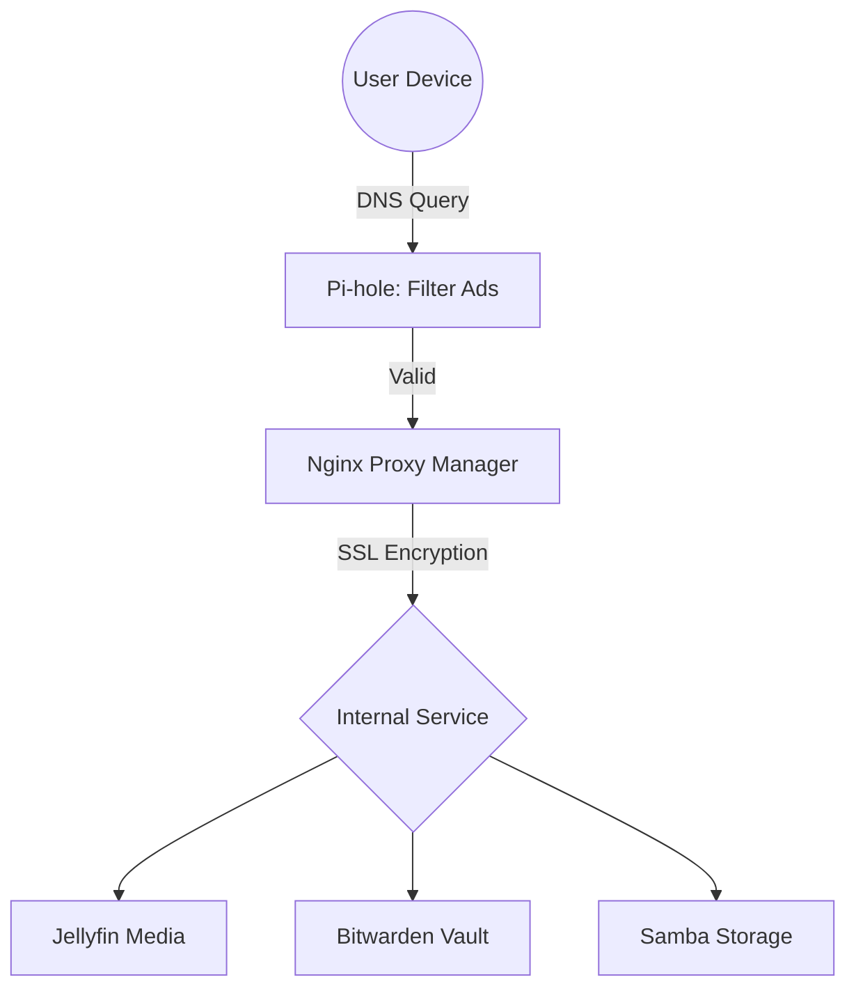

  

  ### **The User Documentation**
  *A userc guide for accessing media, storage, and security services.*

  
  
  
  
  
  [🚀 Quick Access](#quick-access) • [❓Troubleshooting](#common-fixes)

---

## 🗺️ How it Works
When you access a service like `jellyfin.home.arpa`, your request follows this secure path:

<h2>🚀 Quick Access (Dashboard)</h2>

We use Dashy as our central hub. You don't need to remember every IP address; just bookmark the dashboard.

* Primary URL: https://dashy.home.arpa
* Direct IP: `http://192.168.10.5`

| Service    | Local URL               | Purpose                        |
|------------|-------------------------|--------------------------------|
| Jellyfin   | jellyfin.home.arpa      | Movies, TV Shows, and Music.   |
| Bitwarden  | bitwarden.home.arpa     | Secure Password Management.    |
| Pi-hole    | 192.168.10.2/admin      | Ad-blocking stats and DNS.     |

<h2>🛡️ Security Onboarding</h2>

> [!IMPORTANT]
> **Mandatory Setup:** Because we use a private Certificate Authority, your browser will show a "Your connection is not private" warning until you trust our root certificate.

**Trusting the Wojtek Certificate**

1. **Download:** Access the [`Local-CA.crt`](https://downgit.github.io/#/home?url=https:%2F%2Fgithub.com%2FJordynns%2FWojtek-Network%2Fblob%2Fmain%2Fresources%2FLocal-CA.crt) file from our shared repository.
2. **Windows:**
   * Double-click the file -> Install Certificate.
   * Select **Local Machine**.
   * Choose **Place all certificates in the following store** -> **Trusted Root Certification Authorities**.
3. **Browsers (Firefox):** You must manually import the certificate under **Settings > Privacy & Security > Certificates > View Certificates > Import**.

<h2>📂 Network Storage (NAS)</h2>

The network provides a centralized location for file sharing and backups.

**Mapping the Drive (Windows)**

To make the NAS appear as a drive (e.g., the `Z:` drive) on your PC:

1. Open **File Explorer**.
2. Right-click **This PC** -> **Map network drive...**
3. Folder: `\\192.168.10.3\nas`
4. Check **Connect using different credentials**.
5. Enter your assigned `nasuser` credentials.

> [!TIP]
> Use the command line for a quick mount:
> `net use Z: \\192.168.10.3\nas /persistent:yes`

<h2>❓ Common Fixes</h2>

**I can't reach any ".home.arpa" websites.**
* **Check DNS:** Ensure your device is receiving its IP via DHCP from pfSense. Your DNS server should be set to `192.168.10.2`.
* **VPN:** Disable any external VPNs (NordVPN, ExpressVPN, etc.), as they bypass our local routing.

**Jellyfin is asking for a "Server Address".**
* Enter: `http://192.168.10.4` or `https://jellyfin.home.arpa`.

**Why is Shae in the team list?**
* This is an architectural mystery. We are currently treating this as a "feature" rather than a "bug."

  Designed, deployed, and documented by the Wojtek team 🖧

